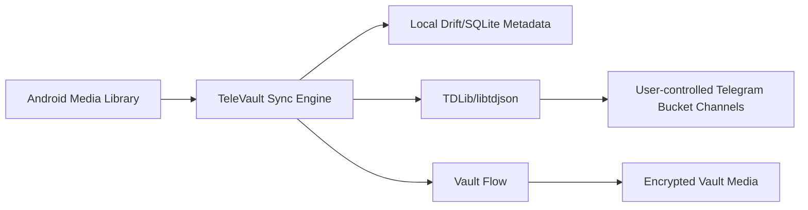

# TeleVault

[](https://github.com/Shagiz-Technologies/televault/actions/workflows/flutter-ci.yml)


A Flutter Android media library, backup manager, and vault for people who want their personal media organized locally and backed up to private Telegram channels they control.

An open-source Android app for backing up, organizing, and protecting personal media using a Telegram-backed storage model.

TeleVault is an independent project and is not affiliated with, endorsed by, or sponsored by Telegram.

> TeleVault explores a Telegram-as-Storage (TaaS) model: your own Telegram account acts as the storage backend, while TeleVault provides the media library, bucket organization, vault, sync state, and local privacy controls.

## Quick Navigation

- [What is TeleVault?](#what-is-televault)
- [Choose your path](#choose-your-path)
- [The idea: Telegram-as-Storage (TaaS)](#the-idea-telegram-as-storage-taas)
- [How it works](#how-it-works)
- [Features](#features)
- [Privacy & security](#privacy--security)
- [What is encrypted?](#what-is-encrypted)
- [Build from source](#build-from-source)
- [Roadmap preview](#roadmap-preview)
- [Contributing](#contributing)

## What is TeleVault?

TeleVault is a privacy-conscious Android app built with Flutter. It lets a user sign in with their own Telegram account, create private channel buckets, scan local photos and videos, track backup state in a local Drift/SQLite database, and protect selected media through a vault flow.

The goal is simple: make backup feel familiar like a modern gallery app, while keeping storage tied to the user's own Telegram account instead of a TeleVault-operated backend server.

## Choose your path

| If you want to... | Start here |
| --- | --- |
| Understand the idea | [What is TeleVault?](#what-is-televault) |
| Build the app locally | [Build from source](#build-from-source) |
| Check privacy boundaries | [Privacy & security](#privacy--security) |
| See what is encrypted | [What is encrypted?](#what-is-encrypted) |
| Contribute code or docs | [Contributing](#contributing) |
| Report a security issue | [Security](#security) |

## The idea: Telegram-as-Storage (TaaS)

TeleVault explores a Telegram-as-Storage (TaaS) model: your own Telegram account acts as the storage backend, while TeleVault provides the media library, bucket organization, vault, sync state, and local privacy controls.

In practical terms:

- The user signs in with their own Telegram account.
- Private Telegram channels are used as backup buckets.
- TeleVault keeps local metadata so it can track pending, uploading, synced, failed, vaulted, and deleted-local states.
- TDLib/libtdjson powers Telegram integration.
- TeleVault does not operate a backend server in this repository.
- Telegram and TDLib still process account login, channel access, and uploaded files.
- Normal non-vault media is not client-side encrypted by TeleVault in the current implementation.

## How it works



At a high level, TeleVault scans Android photos/videos, records metadata locally, and sends selected backup items to private Telegram bucket channels. Vault-selected media goes through the vault encryption flow before being stored as vaulted content.

## Features

- [x] Telegram login through TDLib/libtdjson
- [x] Private channel buckets
- [x] Photo/video scanning
- [x] Local metadata database
- [x] Library-first UI with albums, filters, selection, labels, and media previews
- [x] Backup state indicators for queued, uploading, synced, failed, vaulted, and deleted-local items
- [x] Bucket preferences for media type and sync behavior
- [x] Vault lock/unlock support with a Vault PIN or password and device biometric authentication where supported
- [x] Streaming authenticated vault encryption with a separate recovery key
- [x] Metadata export/import
- [x] Safe Uninstall metadata flow
- [ ] Full polished media restore UX
- [ ] Android 14+ selected photos access review
- [x] TDLib 16 KB page-size verification and reproducible Android provenance
- [ ] All-media client-side encryption

## Privacy & Security

> TeleVault does not include a TeleVault-operated backend server in this repository. Your media is sent to private Telegram channels controlled by your logged-in Telegram account.

Important boundaries:

- No external analytics or telemetry SDK is currently present.
- Local diagnostics are stored locally.
- Contributors must not add external telemetry without explicit user control, documentation, and review.
- Telegram and TDLib still process Telegram login, channel access, and uploaded files.
- Normal non-vault uploads are not client-side encrypted by TeleVault today.
- Vault PIN/password and biometrics are local access controls. Portable v3
  recovery requires the separately exported Vault Recovery Key.

Read the full privacy notes in [`PRIVACY.md`](PRIVACY.md). Security reporting guidance is in [`SECURITY.md`](SECURITY.md).

## What is encrypted?

| Data type | Current behavior |
| --- | --- |
| Vault-protected media | New objects use chunked AES-256-GCM v3 encryption with a random per-file key wrapped by the Vault Recovery Key. |
| Metadata backup packages | Encrypted with a user passphrase and bound to the Telegram account recorded in the snapshot. |
| Normal non-vault uploads | Not client-side encrypted by TeleVault in the current implementation. |

If you need all-media client-side encryption, treat that as future work and do not assume it exists today.

Record the Vault Recovery Key before relying on remote vault backups. Losing
both the installed secure-storage copy and the exported key makes v3 vault
objects unrecoverable; a short PIN or biometric cannot replace it. The
container and migration design is documented in
[`docs/vault-container-v3.md`](docs/vault-container-v3.md).

## Build from source

Prerequisites:

- Flutter stable SDK matching the `pubspec.yaml` SDK constraint.
- Android Studio or Android command-line tools.
- A Telegram API ID and API hash from Telegram's developer portal.
- TDLib/libtdjson native binaries included under `third_party/libtdjson`.

The reproducible Android release baseline is pinned in [`docs/android-release-16kb.md`](docs/android-release-16kb.md).
The typed error, flood-wait, and account-capability policy is documented in [`docs/telegram-reliability.md`](docs/telegram-reliability.md).

```bash
flutter pub get
flutter run \
  --dart-define=TELEGRAM_API_ID=YOUR_TELEGRAM_API_ID \
  --dart-define=TELEGRAM_API_HASH=YOUR_TELEGRAM_API_HASH
```

Do not commit real credentials, `.env` files, keystores, signing files, release APKs/AABs, local databases, Telegram sessions, or user backups.

<details>
<summary>Android permissions</summary>

TeleVault currently requests these Android permissions:

- `INTERNET`: required for Telegram login and backup upload/download.
- `READ_MEDIA_IMAGES`: read image media on Android 13 and newer.
- `READ_MEDIA_VIDEO`: read video media on Android 13 and newer.
- `READ_EXTERNAL_STORAGE` with `maxSdkVersion=32`: read media on older Android versions.
- `ACCESS_MEDIA_LOCATION`: access original media location metadata when Android allows it. This should be reviewed before Play Store release because it is privacy-sensitive.
- `USE_BIOMETRIC` and `USE_FINGERPRINT`: allow device biometrics for app/vault unlock flows where supported.

Android 14+ selected-photos access (`READ_MEDIA_VISUAL_USER_SELECTED`) still needs a dedicated implementation review.

</details>

<details>
<summary>TDLib/libtdjson notes</summary>

TeleVault uses the vendored `third_party/libtdjson` Flutter plugin for TDLib JSON/FFI integration. The vendored plugin metadata points to `https://github.com/up9cloud/flutter_libtdjson` and includes an MIT license. Android `libtdjson.so` binaries are reproducibly built from a pinned official TDLib source commit with NDK r28 and verified for 16 KB page-size compatibility.

See [`docs/android-release-16kb.md`](docs/android-release-16kb.md) for exact source commits, toolchain versions, binary hashes, licenses, and verification commands.

See [`NOTICE.md`](NOTICE.md) for third-party notes.

</details>

<details>
<summary>Build commands</summary>

Install dependencies:

```bash
flutter pub get
```

Run in debug mode:

```bash
flutter run \
  --dart-define=TELEGRAM_API_ID=YOUR_TELEGRAM_API_ID \
  --dart-define=TELEGRAM_API_HASH=YOUR_TELEGRAM_API_HASH
```

Build a release APK locally:

```bash
flutter build apk --release \
  --dart-define=TELEGRAM_API_ID=YOUR_TELEGRAM_API_ID \
  --dart-define=TELEGRAM_API_HASH=YOUR_TELEGRAM_API_HASH
```

</details>

<details>
<summary>Release-signing safety</summary>

Use `android/key.properties.example` as a template for local signing setup. Keep the real `android/key.properties` and keystore file outside Git.

Never commit:

- Telegram API credentials.
- `.env` files.
- Keystores or private keys.
- APK/AAB release artifacts.
- Local SQLite databases.
- Telegram session files.
- Real user media, logs, metadata exports, or backups.

</details>

## Current limitations

- Android is the only supported release target today.
- Android builds are 64-bit only (`arm64-v8a` devices and `x86_64` emulators); 32-bit ARM/x86 are not packaged.
- iOS is experimental for local feasibility testing only. See [`docs/IOS_FEASIBILITY.md`](docs/IOS_FEASIBILITY.md).
- Normal non-vault uploads are not client-side encrypted by TeleVault.
- Full polished media restore UX is not complete.
- Google Drive backup code exists as an experimental prototype and should be removed or documented.
- Play Store compliance review is not complete.
- A physical-device Telegram login and upload smoke test remains required for every release candidate.
- Legacy vault v1/v2 objects remain readable but should be migrated to v3 after
  confirming a Vault Recovery Key.

<details>
<summary>More limitation details</summary>

Flutter-generated iOS, macOS, Linux, Windows, and web folders may exist in this repository, but they are not release-supported yet. iOS TDLib/libtdjson integration still needs validation before Telegram login, backup, or restore can be treated as working there.

The metadata Safe Uninstall restore path exists, but the full user-facing media restore experience still needs product and QA work.

All-media encryption is not implemented. Vault-protected media encryption exists for vault flows only.

</details>

## Roadmap Preview

Near-term release-readiness work is tracked in [`ROADMAP.md`](ROADMAP.md) and GitHub Issues.

| Area | Status |
| --- | --- |
| TDLib native binary provenance | Verified and release-gated |
| Android 14+ selected photos access | Needs review |
| Media permissions minimization | Needs review |
| Full media restore UX | Planned |
| Local DB-at-rest encryption evaluation | Planned |
| Play Store release checklist | Planned |

## Contributing

Contributions are welcome when they keep user privacy, data integrity, and Android reliability in mind.

Start with [`CONTRIBUTING.md`](CONTRIBUTING.md), then open a focused issue or pull request. Changes touching privacy, permissions, encryption, Telegram login, sync, vault, or restore need careful review and Android testing.

## Security

Read [`SECURITY.md`](SECURITY.md) before reporting a vulnerability. Do not open public issues containing secrets, credentials, private metadata, personal media, or exploit details.

## Support TeleVault

TeleVault is maintained independently by Shagiz Technologies. If the project is useful to you, you can [support continued development through PayPal](https://www.paypal.com/paypalme/ZelalemGizachew).

Sponsorship is optional and does not change access to the open-source project.
## License

TeleVault is licensed under the MIT License. See [`LICENSE`](LICENSE).
